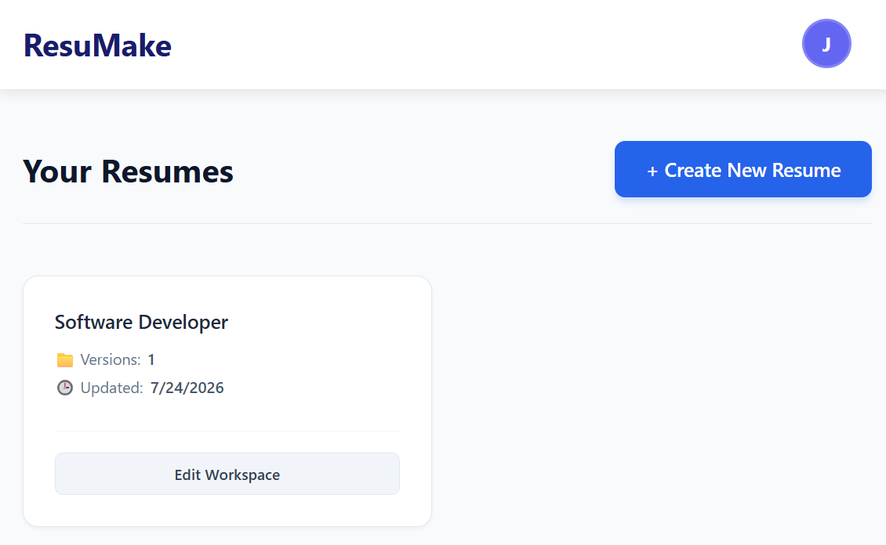
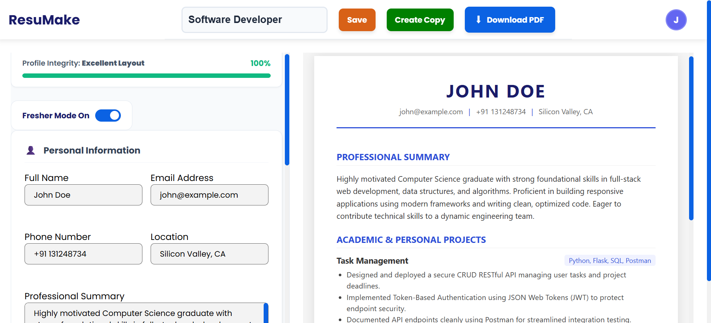
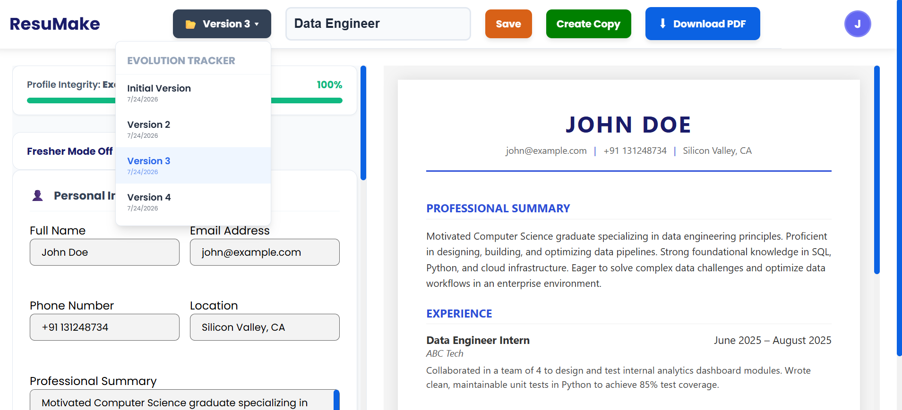
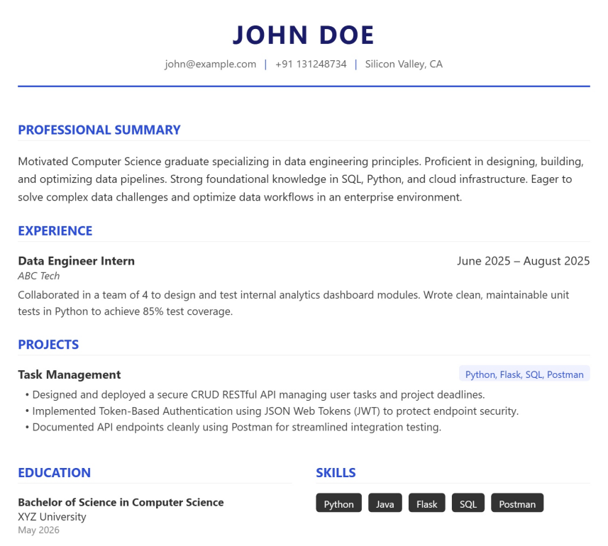

# Smart Resume Builder

A modern, full-stack web application to create, customize, and manage resumes dynamically — with a unique **Evolution Tracker (Version Control)** system that lets you maintain multiple versions of a resume for different roles, without re-entering repeated information.

## Key Features

- **Resume Version Control (Evolution Tracker)** — Create multiple versions of your resume for different job roles while reusing shared data (education, skills, experience) instead of filling everything out again. Previous versions are preserved so you never lose earlier work.
- **Live Resume Preview** — See your resume update in real time as you build it.
- **PDF Export** — Download a polished, print-ready PDF of any resume version.
- **Dynamic Resume Sections** — Add, edit, and rearrange sections (experience, education, skills, projects, etc.) without page reloads.
- **User Authentication** — Secure signup/login so your resumes and versions are tied to your account.
- **Strength Meter** — Indicates the completeness of the resume.

## Tech Stack

| Layer      | Technology                          |
|------------|--------------------------------------|
| Frontend   | React.js, HTML5, CSS3, JavaScript    |
| Backend    | Node.js, Express.js                  |
| Database   | MongoDB                              |
| PDF Export | html2pdf.js                          |
| Auth       | JWT (JSON Web Tokens)                |

## Screenshots

| Screenshot | Description |
|------------|--------------|
|  | Landing page |
|  | Resume builder — form editor with live preview |
|  | Version list showing multiple resume versions for different roles |
|  | Exported, downloaded PDF resume |

## Getting Started

### Prerequisites

- Node.js (v16 or higher)
- npm or yarn
- A MongoDB instance (local or [MongoDB Atlas](https://www.mongodb.com/atlas))

### Installation

1. **Clone the repository**
   ```bash
   git clone https://github.com/Praveen-PRK/Resume-builder.git
   cd resume-builder
   ```
 
2. **Install root dependencies** 
   It includes `concurrently`, used to run client and server together
   ```bash
   npm install
   ```
 
3. **Install server dependencies**
   ```bash
   cd server
   npm install
   ```

4. **Install client dependencies**
   ```bash
   cd ../client
   npm install
   ```

5. **Set up environment variables**

   In the `server` directory, create a `.env` file based on `.env.example`:
   ```
   MONGODB_URI=your_mongodb_connection_string
   JWT_SECRET=your_jwt_secret
   PORT=5000
   ```

6. **Run the app**

   From the **root directory**, run both client and server together with a single command:
   ```bash
   npm run dev
   ```
 
   This uses `concurrently` to start the Express server and the React dev server in parallel.

7. Visit `http://localhost:3000` in your browser or to the URL (`http://localhost:[PORT]`) in your terminal.

## Project Structure

```
smart-resume-builder/
├── client/               # React frontend
│   ├── src/
│   │   ├── components/   # Reusable UI components
│   │   ├── pages/        # Route-level pages
|   |   ├── utils/        # Utility files
│   │   └── App.jsx
│   └── package.json
├── server/               # Express backend
│   ├── config/           # DB and app config
│   ├── models/           # MongoDB schemas
│   ├── routes/           # API routes & Route logic
│   ├── .env
│   └── package.json
└── .gitignore
└── LICENSE
└── package.json
└── README.md
```

## Environment Variables

This project requires the following environment variables (see `server/.env.example`):

| Variable       | Description                          |
|----------------|---------------------------------------|
| `MONGODB_URI`  | MongoDB connection string             |
| `JWT_SECRET`   | Secret key used to sign auth tokens   |
| `PORT`         | Port the server runs on (default 5000)|

## Roadmap / Future Improvements

1. **Building more Resume Templates** - More template styles for resume.
2. **AI Integration** - AI based suggestions for improving user's resume content
3. **Flexible Templates** - Users can reorder resume sections and can add new fields or modify existing sections.
4. **ATS Screening** - Screening resume and providing ATS Score.

## License

> This project is licensed under the [MIT License](LICENSE).

## Author

**Praveen Kumar** — [GitHub](https://github.com/Praveen-PRK)